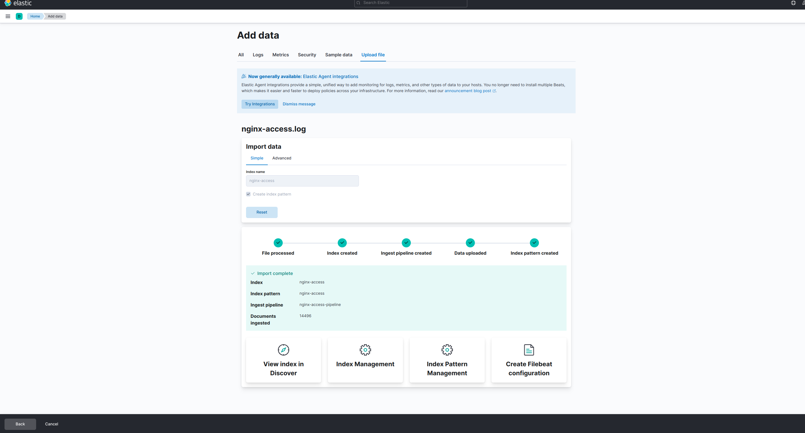

# Exercice 1

1.  Écran d'accueil de Kibana, cliquez sur "Add data"

    

2.  Sélectionnez l'onglet "Upload file"

    

3.  Une fois les données d'échantillon chargées, vous devriez voir un extrait de celles ci s'afficher dans la page. Cliquez sur "Import"

    

4.  Nommez l'index qui stockera les données, ici `nginx-access`. Cliquez sur "Import".

    

5.  Les données vont être automatiquement importées par Kibana dans votre base ElasticSearch:

    
    

6.  Une fois l'import terminé, via le menu de Kibana, naviguez sur la page de gestion des tableaux de bord. Créez un nouveau tableau de bord et cliquez sur "Add you first visualization".

    

7.  Utilisez l'éditeur pour créer les 3 diagrammes demandés en sélectionnant les attributs et en configurant les différents axes de valeurs. Voici le détails de 2 d'entre eux:

    
    

8.  Une fois les 3 diagrammes créés, votre tableau de bord devrait ressembler à celui-ci:

    
